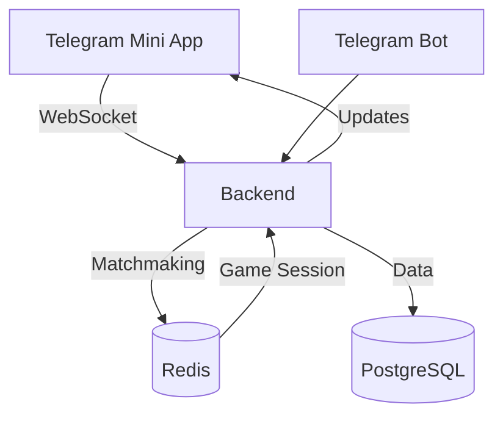

# Seka Card Game (MVP)

**Seka** — это онлайн-игра в карты (вариант покера), реализованная на FastAPI (Python, backend) и React (frontend). Проект поддерживает многопользовательский режим, хранение состояния в PostgreSQL и Redis, а также современный UI с анимациями.

🌍 **Multiplayer** | ⚡ **WebSockets** | 🤖 **Telegram Bot** | 🐳 **Dockerized**  

---

## 🚀 **Технологии**  

| **Часть**       | **Стек**                                                                 |
|----------------|--------------------------------------------------------------------------|
| **Frontend**   | React + TypeScript, Telegram WebApp SDK, Zustand, Canvas/PixiJS          |
| **Backend**    | Python (FastAPI/Flask), PostgreSQL, Redis (матчмейкинг), WebSockets      |
| **Бот**        | Python (aiogram)                                                         |
| **Инфраструктура** | Docker, Nginx, GitHub Actions (CI/CD)                                |

---

## 📦 **Установка и запуск**  

### **1. Клонирование репозитория**  
```bash
git clone https://github.com/IvanZhutyaev/Seka-Card_Game.git
cd Seka-Card_Game
```

### **2. Настройка окружения**  
Создайте `.env` файлы для каждого сервиса (примеры в `.env.example`):  
- `pages/gameplay/.env` — ключи Telegram Mini App  
- `.env` — настройки БД, секреты (в корне проекта)  
- `bot/.env` — токен бота  

### **3. Запуск через Docker**  
```bash
docker-compose up --build
```
Сервисы будут доступны:  
- **Frontend**: `http://localhost:3000`  
- **Backend API**: `http://localhost:8000`  
- **Bot Webhook**: `http://localhost:5000`  

---

## 🛠 **Разработка**  

### **Frontend (React + TypeScript)**  
```bash
cd pages/gameplay
npm install
npm run dev
```

### **Backend (Python)**  
```bash
# Запуск из корня проекта
pip install -r requirements.txt
python server.py
```

### **Бот (aiogram)**  
```bash
cd bot
pip install -r requirements.txt
python bot.py
```

---

## 🌐 **Архитектура**  



---

## 📄 **Лицензия**  
**MIT License** — свободное использование с указанием авторства.  

--- 

## 🤝 **Как помочь проекту?**  
1. **Форкните репозиторий**  
2. Создайте ветку: `git checkout -b feature/your-feature`  
3. Запушите изменения: `git push origin feature/your-feature`  
4. Откройте **Pull Request**  

---

## 📬 **Контакты**  
- **Авторы**: Иван Жутяев, Ломовской Артём
- **Telegram**: @RodionCodeForge 
- **Почта**: ivan.zhutyaev@mail.ru

--- 

✨ **Удачной игры!** ✨  

## Возможности (MVP)
- Многопользовательская игра через WebSocket
- Матчмейкинг, банк, ставки, пас, определение победителя
- Современный интерфейс (React + Zustand)
- Адаптивная верстка, базовые анимации
- Легко расширяется (аватары, история, рейтинги, Telegram-авторизация и др.)

## Структура проекта

```
Seka-Card_Game/
├── server.py           # FastAPI backend (WebSocket, API)
├── db.py, config.py    # Подключение к PostgreSQL и Redis
├── migrations/         # SQL-миграции для базы
├── game/               # Логика игры (engine, matchmaking)
├── pages/gameplay/     # Frontend (React, макеты, компоненты)
│   ├── components/     # React-компоненты (GameTable, PlayerHand, GameControls)
│   ├── store/          # Zustand store (gameStore.ts)
│   ├── types/          # Типы данных (game.ts)
│   ├── seka_demo.*     # Демо-версия макета (HTML/CSS/JS)
│   ├── index.tsx       # Точка входа React
│   ├── package.json    # Зависимости фронта
│   └── ...
└── ...
```

## Как запустить (инструкция для разработчика)

### 1. Backend (FastAPI)
- Установите Python 3.10+
- Установите зависимости:
  ```
  pip install -r requirements.txt
  ```
- Настройте переменные окружения для PostgreSQL и Redis (см. config.py)
- Проверьте, что база данных в кодировке UTF-8
- Запустите сервер:
  ```
  python server.py
  ```

### 2. Frontend (React)
- Установите Node.js (LTS) и npm
- Перейдите в папку фронта:
  ```
  cd pages/gameplay
  ```
- Установите зависимости:
  ```
  npm install --legacy-peer-deps
  ```
- Убедитесь, что файл `public/index.html` существует (скопируйте из index.html при необходимости)
- Запустите приложение:
  ```
  npm start
  ```
- Откройте [http://localhost:3000](http://localhost:3000)

## Типовые ошибки и их решение

- **npm: Could not find a required file. Name: index.html**
  - Создайте папку `public` в pages/gameplay и поместите туда index.html
- **npm ERESOLVE / peer deps**
  - Используйте `npm install --legacy-peer-deps` или откатите typescript до 4.x
- **psql не найден**
  - Установите PostgreSQL и добавьте psql в PATH
- **Database connection error: 'utf-8' codec can't decode...**
  - Пересохраните .env в UTF-8, проверьте кодировку базы (должна быть UTF8)

## MVP: что реализовано
- Полный цикл игры (создание, ставки, пас, победа)
- Многопользовательский режим через WebSocket
- Современный UI, адаптивность, базовые анимации
- Легко расширяется для production

## Демо и макеты
- Для быстрой проверки UI используйте `pages/gameplay/seka_demo.html` (откройте в браузере)
- Для интеграции в React используйте компоненты из `components/` и логику из `store/gameStore.ts`

## Roadmap (что можно добавить)
- Улучшенные анимации (раздача, ставки, победа)
- Авторизация (Telegram, email)
- История игр, рейтинги, аватары
- Защита от читерства, логирование, мониторинг
- Production-сборка (Docker, CI/CD)

**Вопросы, баги, предложения — пишите в Issues или напрямую разработчику!**
