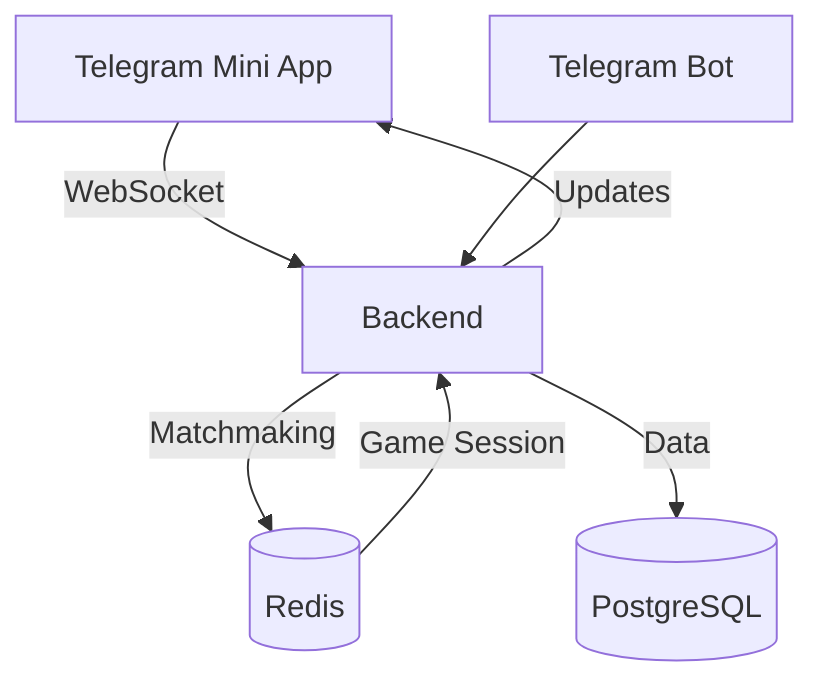

# 🎮 **Seka — PvP-игра в Telegram Mini App**  

**Онлайн-игра "Сека" с реальными соперниками**  
🌍 **Multiplayer** | ⚡ **WebSockets** | 🤖 **Telegram Bot** | 🐳 **Dockerized**  

---

## 🚀 **Технологии**  

| **Часть**       | **Стек**                                                                 |
|----------------|--------------------------------------------------------------------------|
| **Frontend**   | React + TypeScript, Telegram WebApp SDK, Zustand, Canvas/PixiJS          |
| **Backend**    | Python (FastAPI/Flask), PostgreSQL, Redis (матчмейкинг), WebSockets      |
| **Бот**        | Python (aiogram)                                                         |
| **Инфраструктура** | Docker, Nginx, GitHub Actions (CI/CD)                                |

---

## 📦 **Установка и запуск**  

### **1. Клонирование репозитория**  
```bash
git clone https://github.com/IvanZhutyaev/Seka-Card_Game.git
cd seka-game
```

### **2. Настройка окружения**  
Создайте `.env` файлы для каждого сервиса (примеры в `.env.example`):  
- `client/.env` — ключи Telegram Mini App  
- `server/.env` — настройки БД, секреты  
- `bot/.env` — токен бота  

### **3. Запуск через Docker**  
```bash
docker-compose up --build
```
Сервисы будут доступны:  
- **Frontend**: `http://localhost:3000`  
- **Backend API**: `http://localhost:8000`  
- **Bot Webhook**: `http://localhost:5000`  

---

## 🛠 **Разработка**  

### **Frontend (React + TypeScript)**  
```bash
cd client
npm install
npm run dev
```

### **Backend (Python)**  
```bash
cd server
pip install -r requirements.txt
uvicorn main:app --reload
```

### **Бот (aiogram)**  
```bash
cd bot
pip install -r requirements.txt
python bot.py
```

---

## 🌐 **Архитектура**  



---

## 📄 **Лицензия**  
**MIT License** — свободное использование с указанием авторства.  

--- 

## 🤝 **Как помочь проекту?**  
1. **Форкните репозиторий**  
2. Создайте ветку: `git checkout -b feature/your-feature`  
3. Запушите изменения: `git push origin feature/your-feature`  
4. Откройте **Pull Request**  

---

## 📬 **Контакты**  
- **Авторы**: Иван Жутяев, Ломовской Артём
- **Telegram**: @RodionCodeForge 
- **Почта**: ivan.zhutyaev@mail.ru

--- 

✨ **Удачной игры!** ✨  
